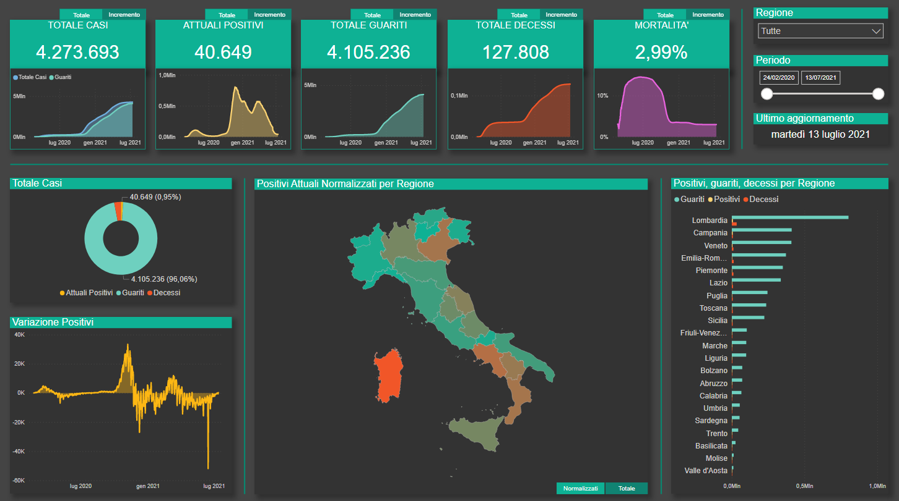
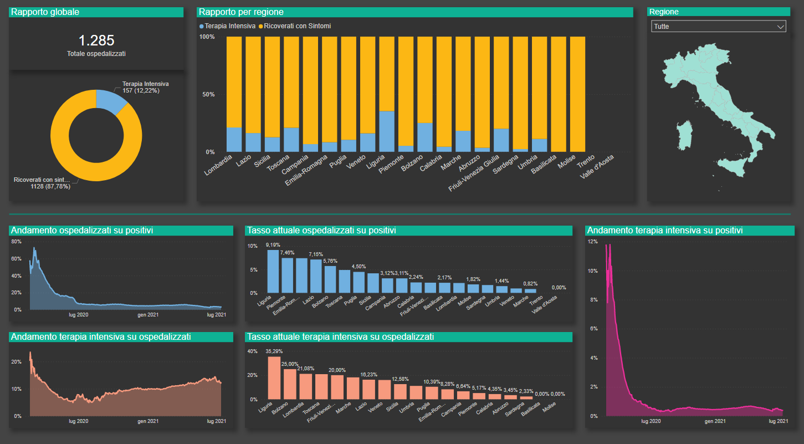
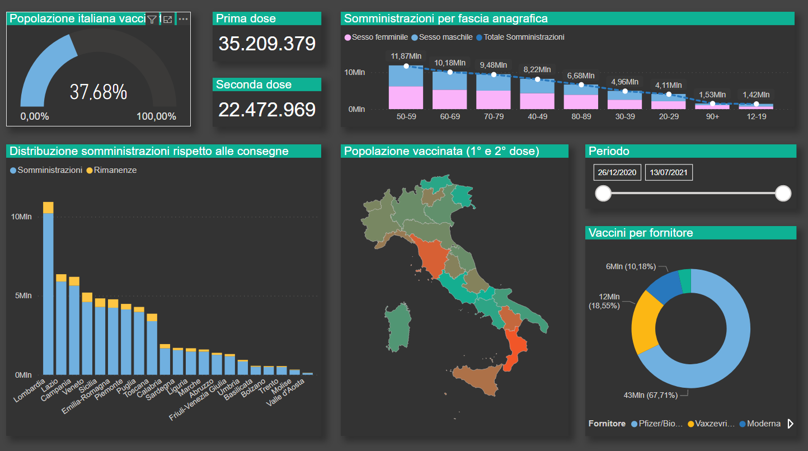

<h1 align="center">Covid-19 Open Dashboard</h1>

Development and implementation of a dashboard for covid data analysis in Italy. 

# Motivations
In today’s global emergency situation everyone wants and waits for the end of the pandemic, and this helps to increase 
interest in getting real-time updates on the global situation. One of the most efficient solutions to allow people to update 
themselves autonomously, directly reading clean data without mediation but, at the same time, being able to interpret them 
in a simple and immediate way, is represented by the dashboards.

# Project description
The dashboard is developed in PowerBi and analyzes the daily data provided by the Italian civil protection.
 - https://github.com/pcm-dpc/COVID-19
 - https://github.com/italia/covid19-opendata-vaccini

# Dashboards overview

 

 

